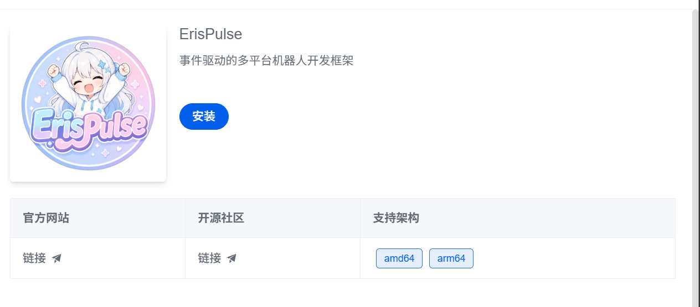

<div align="center">

# ErisPulse 1Panel App Store



[English](#english) | [简体中文](#简体中文)

</div>

---

<a id="english"></a>

## English

ErisPulse 1Panel App Store integration. One-click install ErisPulse via [1Panel](https://1panel.cn).

Visit [get-1panel.erisdev.com](https://get-1panel.erisdev.com) for a guided setup page.

### Quick Install

**1Panel Scheduled Task (recommended):**

Create a Shell script task in 1Panel → Scheduled Tasks, paste:

```bash
bash <(curl -sL https://get-1panel.erisdev.com/install.sh)
```

Or with wget: `bash <(wget -qO- https://get-1panel.erisdev.com/install.sh)`

**Manual:**

```bash
git clone -b main --depth 1 https://github.com/ErisPulse/ErisPulse-1Panel /tmp/erispulse-1panel
cp -rf /tmp/erispulse-1panel/apps/erispulse /opt/1panel/resource/apps/local/
rm -rf /tmp/erispulse-1panel
```

After install, click **"Update App List"** in 1Panel App Store.

### Uninstall

```bash
bash <(curl -sL https://get-1panel.erisdev.com/uninstall.sh)
```

### Update

Re-run the install command to overwrite. **Docker only runs the container; framework updates are handled via Dashboard hot-update.**

### Directory Structure

```
ErisPulse-1Panel/
├── wrangler.toml                   # Cloudflare Worker config
├── package.json
├── scripts/
│   ├── install.sh
│   └── uninstall.sh
├── worker/src/index.js             # Worker entry
└── apps/erispulse/
    ├── data.yml
    ├── logo.png
    ├── README.md
    ├── latest/
    │   ├── docker-compose.yml
    │   └── data.yml
    └── 2.4.5 ~ 2.5.2.dev0/          # Deprecated: removed
```

---

<a id="简体中文"></a>

## 简体中文

ErisPulse 的 [1Panel](https://1panel.cn) 应用商店适配，支持一键安装。

访问 [get-1panel.erisdev.com](https://get-1panel.erisdev.com) 获取可视化安装指引。

### 快速安装

**1Panel 计划任务（推荐）：**

在 1Panel → 计划任务中创建 Shell 脚本任务，粘贴：

```bash
bash <(curl -sL https://get-1panel.erisdev.com/install.sh)
```

或使用 wget：`bash <(wget -qO- https://get-1panel.erisdev.com/install.sh)`

**手动安装：**

```bash
git clone -b main --depth 1 https://github.com/ErisPulse/ErisPulse-1Panel /tmp/erispulse-1panel
cp -rf /tmp/erispulse-1panel/apps/erispulse /opt/1panel/resource/apps/local/
rm -rf /tmp/erispulse-1panel
```

安装后在 1Panel 应用商店中点击 **「更新应用列表」** 刷新。

### 卸载

```bash
bash <(curl -sL https://get-1panel.erisdev.com/uninstall.sh)
```

### 更新

重新执行安装命令即可覆盖更新。**Docker 仅负责运行容器，框架更新请通过 Dashboard 热更新完成。**